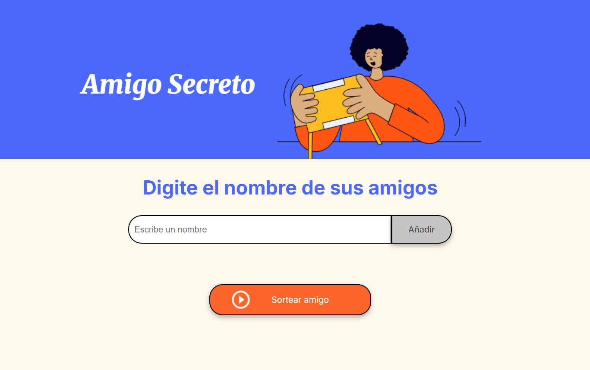

<h1> Amigo Secreto </h1>

Una aplicación web desarrollada como parte del **Challenge de JavaScript** del programa Oracle Next Education (ONE) en colaboración con Alura LATAM.

<h3>¿De que trata?</h3>
Esta aplicación permite a los usuarios ingresar una lista de nombres para realizar un **sorteo aleatorio** y determinar quién será el **amigo secreto**. Ideal para dinámicas en fiestas, equipos o celebraciones.



<h3>Funcionalidades</h3>
-  Agregar nombres: El usuario puede ingresar nombres en un campo de texto y añadirlos a una lista visible.
-  Validación: Si el campo de texto está vacío, se mostrará una alerta solicitando un nombre válido.
-  Visualización: Los nombres se mostrarán en una lista debajo del campo de entrada.
-  Sorteo aleatorio: Al hacer clic en "Sortear Amigo", se seleccionará un nombre al azar de la lista.

<h3>Tecnologías utilizadas</h3>
- HTML5
- CSS3
- JavaScript

<h3>Comó utilizar</h3>
<ol>
  <li>Clona el repositorio:</li>
  ```bash
   git clone https://github.com/VictoriaGrageda/amigo-secreto-challenge-one.git
  <li>Abre el archivo index.html en tu navegador de preferencia</li>
  Listo!! hora de juego
</ol>

<h3>Autores</h3>
- *Maria Victoria Grageda Vallejos* [@VictoriaGrageda](https://github.com/VictoriaGrageda)

